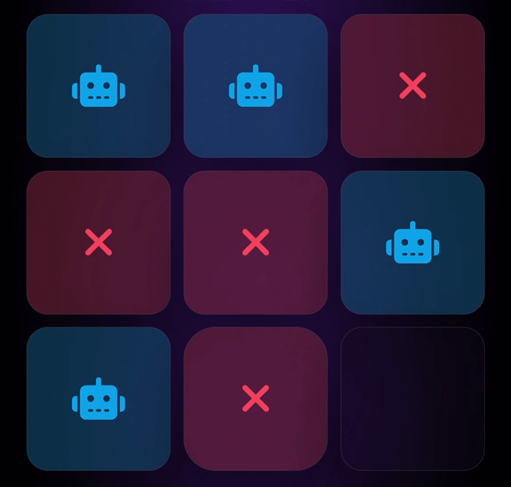

## 🤖 Tic-Tac-Toe: Minimax AI

A lightweight Tic-Tac-Toe game built from scratch with Vanilla JavaScript, a custom EventBus, multiple CPU decision strategies, and a recursive Minimax engine.

This project is a practical implementation of a Tic-Tac-Toe game using only Vanilla JavaScript. The main focus is on separating game state, UI updates, event communication, and CPU decision-making through a small event-driven architecture.

The CPU supports two distinct strategic systems: a heuristic "decisionEngine" for lightweight move selection and a recursive "miniMaxEngine" for exhaustive game-state evaluation.

## 🎬 Demo

> The demo shows the Minimax AI playing against the player, evaluating possible moves and either winning or forcing a draw.

## ✨ Features

* **Event-Driven Architecture:** A custom "EventBus" implements a lightweight Pub/Sub system. Game state changes publish events such as "moveMade", "turnChanged", "playerWin", and "cpuWin", allowing the board, UI, turn manager, and score system to react without being tightly coupled.

* **Heuristic Decision Engine:** The "decisionEngine" provides the lightweight CPU strategy. It checks for immediate winning moves, blocks the player's winning move, prioritizes the center, selects available corners, and falls back to a random move when necessary. This approach is fast and does not require recursive search.

* **Recursive Minimax Engine:** The "miniMaxEngine" evaluates possible future board states recursively. It simulates both CPU and player moves, propagating scores back through the decision tree to select the highest-scoring move. Terminal states are weighted according to the result and adjusted by search depth so that faster victories are preferred and later losses are delayed.

* **Multiple CPU Modes:** The difficulty system exposes three practical behaviors: random play, the heuristic "decisionEngine", and the full "miniMaxEngine". This makes the AI behavior configurable without changing the game loop itself.

* **Asynchronous Turn Handling:** CPU moves are delayed with "async/await" and "Promise"-based timers to simulate thinking time. During the CPU turn, board pointer events are disabled so player input cannot interfere with the pending decision.

* **Reset Race Protection:** "resetCounter" is used as a lightweight invalidation mechanism for delayed CPU actions. A pending turn checks whether the game was reset before applying its move, preventing stale asynchronous callbacks from modifying a new match.

* **Centralized Game Rules:** Win detection is based on a fixed set of eight winning patterns. The same rule definitions are reused by normal gameplay and the Minimax search instead of duplicating board evaluation logic.

* **Score Tracking:** "scoreManager" keeps player wins, CPU wins, and ties in memory and updates the corresponding UI elements after each finished match.

* **Dynamic Theme & Difficulty Settings:** Theme and difficulty preferences are stored in "localStorage", allowing the selected configuration to be restored when the page is opened again.

* **Dynamic Board Rendering:** The board cells are generated programmatically from the current game state. Player and CPU moves are reflected through CSS classes and Font Awesome icons instead of hardcoded board markup.

## 🛠️ Technologies Used

* **Vanilla JavaScript (ES6+):** Game state, EventBus, turn management, AI logic, recursive Minimax search, asynchronous control flow, DOM manipulation, and browser persistence.
* **CSS3:** Uses CSS classes, custom properties, dynamic theme attributes, Grid/Flexbox layouts, and state-based classes for board interaction and visual feedback.
* **HTML5:** Provides the structural UI, configuration controls, score display, and board container used by the JavaScript runtime.
* **LocalStorage API:** Persists theme and difficulty preferences across sessions.

---

## 🧠 CPU Decision Systems

The project intentionally separates the CPU into two different decision approaches.

### **DecisionEngine**

The heuristic engine makes a decision without searching the complete game tree.

Its priority order is approximately:

1. Win immediately if possible.
2. Block the player's immediate win.
3. Take the center.
4. Select an available corner.
5. Fall back to a random move.

This makes the engine computationally cheap and predictable while still producing reasonably structured gameplay.

### **MiniMaxEngine**

The Minimax engine takes a different approach. Instead of relying on a fixed set of priorities, it recursively simulates possible future moves for both players until reaching a terminal state.

The evaluation uses:

* "+10" for CPU victories.
* "-10" for player victories.
* "0" for ties.
* Search depth adjustments to prefer faster CPU wins and postpone losses.

Because Tic-Tac-Toe has a small finite state space, a complete recursive search is practical for this game size.

## 🚀 Future Improvements

* **Clearer Difficulty Model:** Replace the numeric difficulty values ("0", "1", "2") with named strategies or constants. This would make the relationship between UI options and CPU behavior easier to understand and maintain.

* **Accessibility Improvements:** Improve keyboard navigation, focus states, semantic controls, and status announcements so game state changes are accessible without relying exclusively on visual feedback.
